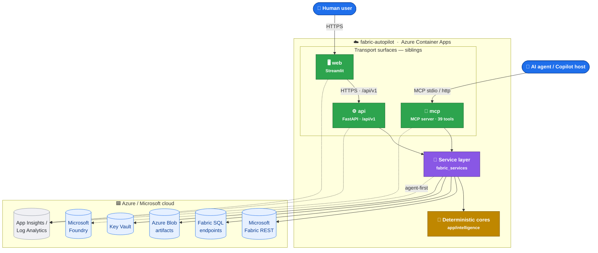

# fabric-autopilot

**End-to-end automation for Microsoft Fabric semantic models and reports — for humans *and* agents.**

Explore → Design → Audit → Publish. One service layer. Three surfaces (REST API, MCP server, Web UI). Zero secrets. Deployable to Azure with a single `azd up`.

Microsoft Fabric · Power BI · Azure Container Apps · Microsoft Foundry · Model Context Protocol · FastAPI · Streamlit

**[Quickstart](#-quickstart-local)** · **[Architecture](docs/architecture.md)** · **[API Reference](docs/api.md)** · **[AI Components](docs/ai-components.md)** · **[Deployment](docs/deployment.md)** · **[Onboarding](docs/onboarding.md)**

---

> **Human parity by design. Deterministic by default. Agentic by preference.**
> One service layer describes every capability; one command reproduces the whole platform in Azure; every write to Fabric is opt-in and auditable.



## Why fabric-autopilot

Building on Microsoft Fabric today means stitching together the Fabric REST API, the SQL endpoint, TMDL/TMSL model definitions, PBIR report definitions, the Best-Practice Analyzer, and — if you want any AI leverage — a bespoke prompt harness for Copilot or Foundry. Every team rebuilds the same plumbing, the AI code paths are one-off scripts, and the human UI and the agent surface end up implementing the same logic twice (or worse, drifting apart).

**fabric-autopilot fixes this.** One service layer owns every capability — schema extraction, star-schema design, DAX authoring, model audit, report scaffolding, publish, tenancy, artifacts — and exposes it *identically* through three surfaces:

- A **REST API** (`fabric_api/`, FastAPI, versioned under `/api/v1`, RFC 7807 errors, OpenAPI-first) for human clients and CI/CD.
- An **MCP server** (`fabric_mcp/`, 39 typed tools over stdio or streamable-http) for Copilot, Claude, Cursor, VS Code, and any other MCP-aware agent host.
- A **Streamlit web UI** (`fabric_app/`) that calls the API only — no business logic in the front end.

Every agentic path (design a model, suggest a report, enrich an audit, orchestrate a full pipeline) is **agent-first with a deterministic fallback**: if Microsoft Foundry is unreachable, the platform still works — the deterministic engine produces the same artifact shape from the same inputs.

```yaml
# Everything the platform needs is declared in one place.
# azure.yaml — one command, three containerized services.
name: fabric-autopilot
services:
  api:  { host: containerapp, docker: { path: ./Dockerfile.api } }
  mcp:  { host: containerapp, docker: { path: ./Dockerfile.mcp } }
  web:  { host: containerapp, docker: { path: ./Dockerfile.web } }
```

```bash
git clone https://github.com/harryarce/fabric-autopilot.git && cd fabric-autopilot
azd auth login && azd up      # provisions + deploys the whole platform
```

## The three promises

### 1. Human & agent parity

The REST API and MCP server are **siblings** over one `ServiceContainer` — they never re-implement business logic, they just adapt transport. Anything a human can do through the web UI, an agent can do through an MCP tool call, with the same inputs, the same validation, and the same outputs.

- **12 REST routers** — workspaces, datasources, schemas, semantic-models, reports, audits, artifacts, operations, agents, lifecycle, governance, health.
- **39 MCP tools** — every service method typed and exposed to agent hosts, including `run_agent_team` and `agent_team_status` for multi-agent orchestration.
- **One idempotent operation store** — `POST /publish` returns an `operation_id`; both the API and the MCP surface can re-fetch results via `GET /api/v1/operations/{id}`.
- **Streamlit Agent Studio** — the same orchestration is reachable to end users through a chat-style UI.

### 2. Deterministic by default, agentic by preference

Every high-value capability has a **rules-based core** with no network or AI dependency — and an **optional Foundry-backed agent** that improves output when available. The cores round-trip TMDL/TMSL/PBIR losslessly, so every generated artifact is git-diffable and reviewable.

- **Deterministic cores (`app/intelligence/`)** — dataclasses, TMDL/TMSL parse+emit, PBIR emit, BPA-style rules, Copilot-readiness suggestions, DAX generation from intent, WCAG/accessibility remediation.
- **Foundry-backed agentic layer** — `SemanticModelIntelligence`, `report_design_agent`, `audit/report_agent` upgrade the core outputs when `FOUNDRY_*` env vars are set. `is_available()` gates every call and cleanly falls back.
- **Multi-agent team (`fabric_api/agents/`)** — `fabric-orchestrator` coordinates specialists (`semantic-model-architect`, `dax-specialist`, `model-auditor`, `report-designer`) through the *schema → model → audit → report → audit* pipeline.
- **File-based skills** — procedural playbooks (`semantic-model-builder`, `fabric-report-design`, `powerbi-modeling-mcp-bridge`, `fabric-agentic-orchestration`) loaded via the Agent Framework `SkillsProvider`.
- **Power BI Modeling MCP bridge** — opt-in integration with the official `@microsoft/powerbi-modeling-mcp` server for **live Tabular Object Model editing** (measures, relationships, calculation groups, RLS).

### 3. Secretless & Azure-native

Authentication is exclusively `DefaultAzureCredential`. In Azure, a **user-assigned Managed Identity** is granted the exact roles it needs (Storage Blob Data Contributor, Key Vault Secrets User, AcrPull). Locally, your `az login` identity is used. There are no API keys, connection strings, or client secrets anywhere in the app or the Bicep.

- **`azd up` provisions the whole stack** — Container Apps environment, ACR (Basic), user-assigned MI, Storage (blob artifacts container), Key Vault (RBAC), Log Analytics, Application Insights.
- **All write paths to Fabric are opt-in** — publish endpoints require explicit intent, are approval-gated for the agent team, and record an audit trail via `AuditLogService`.
- **Multi-tenant ready** — `TenantContext` threads a tenant id through every service; blob artifacts are prefixed with `tenants/<id>/`. Single-tenant is the default; isolation can be enforced later without restructuring.
- **First-class observability** — every surface emits to Application Insights via `azure-monitor-opentelemetry`; the operation store and audit log persist run history.
- **RFC 7807 errors** — every failure is a `application/problem+json` document with stable codes (`not_found`, `validation_error`, `dependency_unavailable`, `fabric_access_denied`, `upstream_error`).

## 🚀 Quickstart (local)

**Prerequisites:** Python 3.10+, Azure CLI, [ODBC Driver 18 for SQL Server](https://learn.microsoft.com/sql/connect/odbc/download-odbc-driver-for-sql-server) (for Fabric SQL endpoint schema extraction), and — optionally — Node.js 20+ (only if you want the Power BI Modeling MCP bridge to run locally).

```powershell
# 1. Clone
git clone https://github.com/harryarce/fabric-autopilot.git
cd fabric-autopilot

# 2. Install (all extras: api, mcp, web, agents)
python -m pip install -e ".[dev]"

# 3. Sign in (local dev uses your Azure CLI identity)
az login

# 4. Run the API
uvicorn fabric_api.main:app --reload          # http://localhost:8000/docs

# 5. Run the web UI against the API (separate terminal)
$env:FABRIC_API_BASE_URL = "http://localhost:8000"
streamlit run fabric_app/streamlit_app.py

# 6. (optional) Run the MCP server for an agent host
python -m fabric_mcp                          # stdio transport
```

Run the tests and linter:

```powershell
python -m unittest discover -s tests
ruff check .
```

<details>
<summary>One-shot dev bootstrap (Windows)</summary>

```powershell
./start-dev.ps1
```

Launches the API, MCP server, and Streamlit UI in three terminals with the right environment variables wired in.

</details>

<details>
<summary>Wire the MCP server into VS Code / Claude Desktop / Cursor</summary>

Point your MCP-aware host at the local server (stdio transport):

```jsonc
{
  "mcpServers": {
    "fabric-autopilot": {
      "command": "python",
      "args": ["-m", "fabric_mcp"]
    }
  }
}
```

39 typed tools become available: `list_workspaces`, `extract_schema`, `design_semantic_model`, `suggest_report`, `audit_semantic_model`, `run_agent_team`, `publish_semantic_model`, and more. Full list in [docs/ai-components.md](docs/ai-components.md).

</details>

## ☁️ Deploy to Azure

```powershell
azd auth login
azd up
```

This single command provisions **all** the infrastructure and deploys **all three** container images:

| Resource | Purpose |
| --- | --- |
| Azure Container Apps environment | Hosts `api`, `mcp`, `web` |
| Azure Container Registry (Basic) | Image store |
| User-assigned Managed Identity | Secretless auth for every service |
| Azure Storage (Blob) | Artifact store (`artifacts` container, per-tenant prefix) |
| Azure Key Vault (RBAC) | Secret store (empty by default) |
| Log Analytics + Application Insights | Observability for all three surfaces |

The existing Microsoft Foundry project is **reused, not created** — pass its endpoint through the `FOUNDRY_*` environment variables. See [docs/deployment.md](docs/deployment.md) for the full flow, Bicep reference, and post-deploy validation.

> **⚠️ Fabric prerequisite:** the platform identity must be allowed to call Fabric APIs and be granted a role on each target workspace. See [docs/onboarding.md](docs/onboarding.md) for the tenant-admin and workspace-admin steps.

## 🧭 Architecture at a glance

| Layer | Package | Responsibility |
| --- | --- | --- |
| **Frontend** | `fabric_app/` | Streamlit UI + typed `FabricApiClient`. Calls the API only — no business logic. |
| **Agent facade** | `fabric_mcp/` | MCP server exposing the service layer as **39 typed tools** (stdio + streamable-http), including multi-agent orchestration. |
| **REST API** | `fabric_api/` | Stateless, versioned FastAPI app under `/api/v1`. RFC 7807 errors, OpenAPI, correlation headers, `agents/` orchestration layer. |
| **Service layer** | `fabric_services/` | `ServiceContainer` + tenant-aware services (schema, model, report, audit, artifact, provisioning, intelligence, lifecycle, governance, audit-log). Single source of truth for every capability. |
| **Data layer** | `app/fabric_client.py`, `app/sql_client.py`, `app/auth.py`, `app/artifacts.py` | Fabric REST (list/create/update, pagination, LRO polling), SQL over pyodbc, Managed Identity token provider, local + blob artifact stores. |
| **Deterministic cores** | `app/intelligence/` | Pure dataclasses, TMDL/TMSL parse+emit, PBIR emit, BPA rules, Copilot-readiness suggestions, DAX generation, accessibility remediation. No network or AI dependency. |
| **Agentic layer** | `app/intelligence/agent.py`, `report_design_agent.py`, `audit/report_agent.py` | Foundry-backed design / suggestion / audit enrichment. Lazy, gated by `is_available()`, deterministic fallback. |
| **Orchestration** | `fabric_api/agents/` | Multi-agent team (`fabric-orchestrator` + specialists) with approval-gated publish, opt-in Power BI Modeling MCP bridge, and file-based skills. Reachable via API, MCP, and the Agent Studio tab. |

Full component, sequence, auth, tenancy, and deployment diagrams live in [docs/architecture.md](docs/architecture.md). AI-specific architecture (MCP servers, agent team, skills, Foundry integration) is in [docs/ai-components.md](docs/ai-components.md).

## 🧰 Capabilities

<details open>
<summary><b>REST API</b> — 12 routers, versioned under <code>/api/v1</code></summary>

| Area | Endpoints |
| --- | --- |
| Health & readiness | `GET /healthz`, `GET /readyz`, `GET /api/v1/health/fabric` |
| Discovery | `GET /api/v1/workspaces`, `GET /api/v1/workspaces/{id}/datasources/sql-endpoints`, `GET /api/v1/workspaces/{id}/datasources/lakehouses` |
| Schemas | `POST /api/v1/schemas/extract`, `POST /api/v1/schemas/export` (markdown/json/sql) |
| Semantic models | `GET/POST` list, import, **design** (agentic), build-definition, publish |
| Reports | `GET/POST` list, import, **suggest** (agentic), build-definition, publish |
| Audits | `POST /api/v1/audits/semantic-model`, `POST /api/v1/audits/report` |
| Artifacts & operations | `GET /api/v1/artifacts`, `GET /api/v1/artifacts/manifest`, `GET /api/v1/operations/{id}` |
| Agents (first-class) | `POST /api/v1/agents/orchestrate` (SSE), `GET /api/v1/agents/status` |
| Lifecycle & governance | Deployment pipelines, approvals, audit log |

Full contract: [docs/api.md](docs/api.md) · Machine-readable: [docs/openapi.json](docs/openapi.json) · Live at `/docs` (Swagger) and `/redoc`.

</details>

<details open>
<summary><b>MCP server</b> — 39 typed tools for any agent host</summary>

The `fabric_mcp` server (`fabric_mcp/server.py`) is a `FastMCP` app that mirrors the whole service layer. Transports: **stdio** locally, **streamable-http** in the `mcp` container. Highlights:

- Discovery: `list_workspaces`, `list_sql_endpoints`, `list_lakehouses`
- Schema: `extract_schema`, `export_schema`
- Modeling: `list_semantic_models`, `import_semantic_model`, `design_semantic_model`, `build_semantic_model_definition`, `publish_semantic_model`
- Reporting: `list_reports`, `import_report`, `suggest_report`, `build_report_definition`, `publish_report`
- Audit: `audit_semantic_model`, `audit_report`
- Artifacts & ops: `list_artifacts`, `get_artifact_manifest`, `get_operation`
- **Multi-agent orchestration**: `run_agent_team`, `agent_team_status`

</details>

<details>
<summary><b>Agent team & skills</b> — Foundry-backed, deterministic fallback</summary>

- **Agents** (`fabric_api/agents/`): `fabric-orchestrator` (manager), `semantic-model-architect`, `dax-specialist`, `model-auditor`, `report-designer`.
- **Skills** (`fabric_api/agents/skills/`, loaded via `SkillsProvider`):
  - `semantic-model-builder` — spec contract, SQL→tabular type mapping, star-schema, DAX patterns, BPA best practices, deterministic generator.
  - `fabric-report-design` — page archetypes, visual cookbook, layout, typography, accessibility, anti-patterns.
  - `powerbi-modeling-mcp-bridge` — drives the live Power BI Modeling MCP tools; DAX guidelines, naming, Direct Lake guidance.
  - `fabric-agentic-orchestration` — end-to-end pipeline playbook.
- **Model**: defaults to a `gpt-5.4`-class deployment on Microsoft Foundry, configurable via `FOUNDRY_MODEL`.
- **Fallback**: when Foundry is unreachable, the orchestrator runs the identical **deterministic pipeline** — none of the `FOUNDRY_*` variables are strictly required.

</details>

<details>
<summary><b>Deterministic cores</b> — round-trippable model & report engineering</summary>

| Module | Encodes |
| --- | --- |
| `spec.py`, `report_spec.py` | `SemanticModelSpec`, `ReportSpec` dataclasses |
| `tmdl_parser.py`, `definition.py` | TMDL / TMSL parse and emit (lossless) |
| `report_definition.py`, `report_builder.py` | PBIR emit + starter-report scaffolding |
| `bpa.py` | Best-Practice-Analyzer style model rules |
| `suggestions.py` | Copilot-readiness, WCAG/theme remediation |
| `dax_generator.py` | Deterministic DAX generation from intent |
| `audit/` | Rules-based auditors (model + report) with Foundry enrichment hooks |

</details>

## ⚙️ Configuration

All configuration is via environment variables — no config files, no secrets. Container Apps receive these automatically via Bicep.

| Env var | Default | Purpose |
| --- | --- | --- |
| `AZURE_CLIENT_ID` | *(auto)* | User-assigned MI client id (set by Bicep in Azure). |
| `FABRIC_API_BASE_URL` | *(auto)* | Web → API base URL. Set to `http://localhost:8000` for local dev. |
| `FABRIC_ARTIFACT_STORE` | `local` | `local` or `blob`. Set to `blob` in Azure. |
| `FABRIC_BLOB_ACCOUNT_URL` | – | Blob endpoint for artifact store. |
| `FABRIC_BLOB_CONTAINER` | `artifacts` | Blob container name. |
| `FOUNDRY_PROJECT_ENDPOINT` | – | Microsoft Foundry project endpoint. Enables the agentic layer. |
| `FOUNDRY_MODEL` | `gpt-5.4` | Model deployment for the agent team. |
| `FOUNDRY_AGENT_NAME` | *(various)* | Named agent identity in the Foundry project. |
| `FABRIC_AGENT_MANAGER_NAME` | `fabric-orchestrator` | Narrating orchestrator agent. |
| `FABRIC_AGENT_MAX_STEPS` | `8` | Upper bound on orchestration steps. |
| `FABRIC_AGENT_REQUIRE_APPROVAL` | `1` | `0` lets publish workflows auto-approve (dev only). |
| `POWERBI_MODELING_MCP_ENABLED` | `1` | Toggle the Power BI Modeling MCP bridge. |
| `POWERBI_MODELING_MCP_HEADLESS` | `0` | `1` in Azure — inject an MI-issued XMLA bearer token instead of interactive sign-in. |
| `POWERBI_MODELING_MCP_READONLY` | `1` | Restrict the bridge to read-only tools. |
| `APPLICATIONINSIGHTS_CONNECTION_STRING` | – | App Insights ingestion. |

Full reference and defaults: [docs/deployment.md](docs/deployment.md).

## 📁 Repository layout

```
fabric-autopilot/
├─ app/                          # Data layer + deterministic cores + agentic layer
│  ├─ fabric_client.py           #   Fabric REST + LRO polling
│  ├─ sql_client.py              #   Fabric SQL over pyodbc
│  ├─ auth.py                    #   Thread-safe TokenProvider
│  ├─ artifacts.py               #   Local + Blob artifact stores
│  ├─ intelligence/              #   Deterministic cores + Foundry-backed agents
│  │  ├─ spec.py, tmdl_parser.py, definition.py
│  │  ├─ report_spec.py, report_definition.py, report_builder.py
│  │  ├─ bpa.py, suggestions.py, dax_generator.py, nl_to_dax.py
│  │  ├─ pbi_modeling_mcp.py, agent.py, report_design_agent.py
│  │  └─ audit/
│  ├─ ui/                        #   Legacy single-process Streamlit pages
│  └─ streamlit_app.py           #   Legacy direct-mode UI (still runs)
│
├─ fabric_services/              # Service / orchestration layer
│  ├─ container.py, context.py, errors.py
│  ├─ schema_service.py, model_service.py, report_service.py
│  ├─ audit_service.py, audit_log_service.py
│  ├─ artifact_service.py, provisioning_service.py
│  ├─ intelligence_service.py, lifecycle_service.py, governance_service.py
│
├─ fabric_api/                   # REST API (FastAPI, /api/v1)
│  ├─ main.py, settings.py, models.py, errors.py, operation_store.py
│  ├─ routers/                   #   workspaces, datasources, schemas,
│  │                             #   semantic_models, reports, audits,
│  │                             #   artifacts, operations, agents,
│  │                             #   lifecycle, governance, health
│  └─ agents/                    #   Multi-agent team, orchestrator,
│                                #     mcp_clients, skills/
│
├─ fabric_mcp/                   # MCP server (agent-facing facade)
│  ├─ server.py                  #   39 typed tools
│  ├─ serialize.py
│  └─ __main__.py                #   `python -m fabric_mcp`
│
├─ fabric_app/                   # Decoupled Streamlit frontend
│  ├─ streamlit_app.py
│  └─ api_client.py              #   Typed FabricApiClient
│
├─ infra/                        # Bicep IaC
│  ├─ main.bicep, resources.bicep, main.parameters.json
│
├─ docs/                         # architecture, api, ai-components,
│                                #   deployment, onboarding, openapi.json
├─ tests/                        # unittest suite (30+ modules)
├─ scripts/                      # probes (probe_ask_model.py, ...)
├─ artifacts/                    # Local artifact store (per-tenant)
│
├─ Dockerfile.api                # Bakes MS ODBC 18 for Fabric SQL
├─ Dockerfile.mcp                # Bakes Node 20+ for Power BI Modeling MCP
├─ Dockerfile.web                # Streamlit frontend
├─ azure.yaml                    # azd manifest (api, mcp, web)
├─ pyproject.toml                # Package + extras (api / mcp / web / agents / dev)
├─ requirements.txt              # Pinned runtime deps
├─ start-dev.ps1                 # Local three-terminal bootstrap
└─ list_workspaces.py            # CLI helper (admin API)
```

## 📚 Documentation

| Doc | Contents |
| --- | --- |
| [docs/architecture.md](docs/architecture.md) | System context, layered components, design principles, layer reference, sequences, auth model, tenancy, deployment topology. |
| [docs/api.md](docs/api.md) | REST reference, conventions, RFC 7807 error codes, tenancy & correlation headers, every endpoint. |
| [docs/ai-components.md](docs/ai-components.md) | MCP servers, agent team, skills catalog, Foundry configuration, Power BI Modeling MCP bridge. |
| [docs/deployment.md](docs/deployment.md) | `azd up` walkthrough, Bicep reference, all environment variables, post-deploy validation. |
| [docs/onboarding.md](docs/onboarding.md) | Tenant-admin steps, workspace access, multi-tenant scoping, verification. |
| [docs/openapi.json](docs/openapi.json) | Machine-readable API contract. |
| [DEPLOY.md](DEPLOY.md) | Deploy quick reference. |
| [app/README.md](app/README.md) | Legacy direct-mode Streamlit app. |

## ✅ Testing & quality

```powershell
python -m unittest discover -s tests   # unittest suite
ruff check .                           # lint (F, E4/E7/E9, I)
```

- **30+ test modules** in `tests/` covering the API, MCP server, service layer, deterministic cores, agentic layer (with mocked Foundry), TMDL parsing, DAX generation, and audits.
- **CI** in `.github/workflows/` runs lint + tests on every PR, and the deploy workflow uses OIDC-based federated credentials — no long-lived secrets in GitHub.
- Every write to Fabric goes through the operation store and audit log, so runs are reproducible and inspectable.

## 🗺️ Roadmap

Selected next-up items (see the `docs/` roadmap notes and open issues for the current list):

- Broader multi-tenant isolation (row-level partitioning, per-tenant Foundry projects).
- More BPA rules and Copilot-readiness suggestions.
- First-class deployment pipeline integration (Fabric git integration).
- Additional MCP tools for lifecycle & governance surfaces.
- Optional Cosmos DB backend for the operation store & audit log.

## 🤝 Contributing

Contributions and issues are welcome. Please:

1. Open an issue describing the change or bug first.
2. Fork, create a topic branch, and keep changes scoped.
3. Run `ruff check .` and the unittest suite locally before pushing.
4. For agentic changes, include a deterministic fallback and a test that exercises it.

## 🧾 License

MIT. See [LICENSE](LICENSE).

## Trademarks

This project references but is not affiliated with or endorsed by Microsoft. **Microsoft Fabric**, **Power BI**, **Azure**, **Microsoft Foundry**, and related product names are trademarks of the Microsoft group of companies. Use of Microsoft trademarks or logos is subject to and must follow [Microsoft's Trademark & Brand Guidelines](https://www.microsoft.com/en-us/legal/intellectualproperty/trademarks/usage/general). Any use of third-party trademarks or logos is subject to those third parties' policies.

`fabric-autopilot` is an independent, community demo project — not an official Microsoft product.

---

**Built on open standards:** [Model Context Protocol](https://modelcontextprotocol.io) · [OpenAPI](https://www.openapis.org/) · [RFC 7807 Problem Details](https://www.rfc-editor.org/rfc/rfc7807) · [Bicep](https://learn.microsoft.com/azure/azure-resource-manager/bicep/) · [Azure Developer CLI](https://learn.microsoft.com/azure/developer/azure-developer-cli/)

